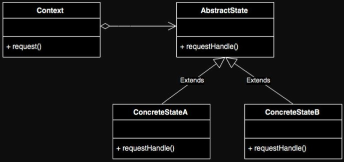
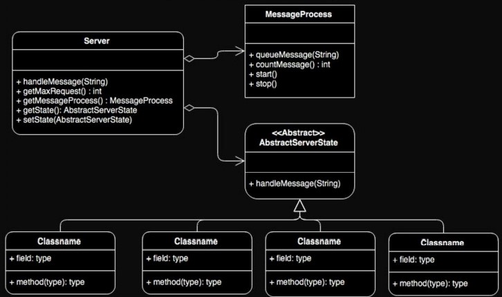

# State Pattern

Los patrones de diseño se originaron como concepto arquitectónico por Christopher Alexander en 1977. En 1987 se comenzó a experimentar con la idea de aplicar patrones a la programación, más específicamente lenguajes de patrones. 

Los patrones de diseño son una solución general y son reutilizables. Son una plantilla sobre cómo resolver un problema que se pueda usar en diferentes situaciones. Son mejoras prácticas formalizadas que se pueden utilizar para resolver problemas comunes al diseñar algún tipo de software.

Los patrones de diseño orientados a objetos por lo general muestran relaciones e interacciones entre objetos. Los patrones que implican un estado mutable pueden ser inadecuados para lenguajes de programación funcionales. Los patrones son casi inútiles si no se puede adecuar al lenguaje seleccionado. 

Hay varios tipos de patrones que resuelven un problema distinto, y se dividen en tres grupos:

- Patrones Creacionales: Relacionados con la construcción de objetos; intentan controlar la forma en que los objetos son creados con la implementación de mecanismos que eviten la creación directa de objetos.

- Patrones Estructurales: Enfocados en la forma en que interactúan o se relacionan con otras clases; ayudan a dar un mayor orden a las clases colaborando a crear componentes más flexibles y extensibles. 

- Patrones de Comportamiento: Relacionados con procedimientos y la asignación de responsabilidad a los objetos; engloban también a los patrones de comunicación entre ellos.

## Explicación

El Patrón State se caracteriza por variar su comportamiento dependiendo del estado en el que se encuentre la aplicación o programa. Para esto es necesario crear varias clases que representen cada uno de los estados. Es confundible con el Patrón Memento, el cual guarde los estados de un objeto en particular con el fin de poder restaurar el estado en un tiempo determinado, añadiendo que este no alterna su comportamiento según el estado. 

Por su parte, State centra su comportamiento en tiempo de ejecución dependiendo del estado; por esto es que unos comportamientos pueden variar en su funcionamiento. Está muy relacionado conceptualmente a una Máquina de Estado Finito.

## Estructura



Context: Representa el componente que puede cambiar de estado, teniendo en sus propiedades el estado actual. 

Abstract State o State: Clase base para generar los distintos estados que se vayan a necesitar. Como su nombre, se recomienda que sea una clase abstracta y no una interface, esto debido a que se pueden llegar a definir comportamientos por default y afectar el comportamiento de los estados.

Concrete State: Representa cada estado posible, que hereda de Abstract State.


Diagrama de secuencia del patrón de diseño State.

1.	Se establece a StateA como estado default a Context.
2.	Se ejecuta la operación request sobre el Context, la cual delega la ejecución al estado actual (StateA).
3.	El Context cambia del estado StateA al estado StateB.
4.	Se ejecuta nuevamente la operación request sobre el Context que delega la ejecución al estado actual (StateB).
5.	La ejecución del StateB da como resultado un cambio de estado al StateC.
6.	Se ejecuta nuevamente la operación request sobre el Context que delega la ejecución al estado actual (StateC).

Los consumidores del Contex siempre ejecutan la misma operación, pero el comportamiento de esta depende del estado que tenga el Contex al ejecutarse. El estado puede ser establecido fuera del Context, pero la ejecución de un método de algún estado puede cambiar el estado.

### Ventajas 
-  Reduce el número de objetos en el sistema, esto si varios hay objetos que comparten un entorno de objeto de estado.
### Desvetajas
- Si este patrón se aplica en casos en los que haya pocos estados o no haya tantos cambios, puede resultar excesivo.


## Escenario 1

Se simulará una pequeña calculadora que tendrá la suma, resta, multiplicación y división. Cada operación representa un estado, y tendrá un número máximo de operaciones.


## Implementación 1

### Clase Calculator 

Representa la calculadora (Context en el Patrón State). Sus Propiedades son:
- Cache: La suma de todos los resultados hayados.
- MaxOperations: El número máximo de operaciones permitidas.
- Operations: Las operaciones hechas.
- Operation: Estado actual.

Las funciones son:
- ChangeState: Cambia el estado e imprime el cambio.
- Calculate: Primero pregunta si el número máximo de operaciones ya fue excedido, en caso que si se haya excedido, cambiará de estado: (SumOperation -> SubtractionOperation),  (MultiplicationOperation -> DivisionOperation),  (SubtractionOperation -> MultiplicationOperation),  (MultiplicationOperation -> SumOperation). Finalmente incremeta el número de operaciones e imprime el resultado del caché.

```cs
public class Calculator {
    public double Number1 {get; set;} = 0f;
    public double Number2 {get; set;} = 0f;
    public double Cache {get; set;} = 0f;
    const int MaxOperations = 3;
    public int Operations = 0;
    public BaseOperation Operation { get; set; }
    
    public Calculator(int operations,double number1, double number2, BaseOperation operation) {
        Operations = operations;
        Operation = operation;
        Number1 = number1;
        Number2 = number2;
    }

    public void ChangeState(BaseOperation operation) {
        Console.WriteLine($"changing... {Operation.GetType()} >>>>>>> {operation.GetType()}");
        Operation = operation;
        Operations = 0;
    }

    public void Calculate() {
        if(Operations > MaxOperations) {
            if(Operation is SumOperation) ChangeState(new SubtractionOperation());
            else if(Operation is MultiplicationOperation) ChangeState(new DivisionOperation());
            else if(Operation is SubtractionOperation) ChangeState(new MultiplicationOperation()); 
            else ChangeState(new SumOperation());
        }
        Operations++;
        Cache = Operation.Operation(Number1,Number2);
        Console.WriteLine("Result: " + Cache);
    }
}
```

### Clase Program

Clase  principal de la aplicación desde la cual se inicia la ejecución(Main), para probar la pequeña calculadora.


Sus funciones son:
- GetOperation: Esta función retorna la operación(estado) que se haya elegido al iniciar la ejecución.


```cs
using System.Text;
public class Program {  

    public static BaseOperation GetOperation(string option) {
        switch (option) {
            case "S": return new SumOperation();
            case "R": return new SubtractionOperation();
            case "M": return new MultiplicationOperation();
            case "D": return new DivisionOperation();
            default: return null;
        }
    }

    public static void Main (string[] args) {
        Console.WriteLine("-----------Calculator-----------");
        Console.Write("number 1: ");
        double number1 = double.Parse(Console.ReadLine() ?? "1");
        Console.Write("number 2: ");
        double number2 = double.Parse(Console.ReadLine() ?? "1");

        Console.Write("Operation (S/R/M/D): ");
        var option = Console.ReadLine() ?? "S";

        var calculator = new Calculator(0,number1,number2, GetOperation(option));
        calculator.Calculate();
        while(calculator.Cache > -1000 || calculator.Cache < 1000) {
            Console.Write("number: ");
            number1 = double.Parse(Console.ReadLine() ?? "1");
            calculator = new Calculator(calculator.Operations, calculator.Cache,number1, calculator.Operation);
            calculator.Calculate();
        }
    }
}

```

## Ejecución 1

Para probar la aplicación se ejecuta la clase Program y se verán los siguientes resultados: 


Como se puede ver, al hacer más operaciones de las permitidas, la Calculadora cambia de estado (Resta). Luego esta cambia a Multiplicación; una muestra de lo que se puede hacer con el patrón State.


## Escenario 2

Se simulará la creación de un servidor, este servidor tendrá como objetivo atender las solicitudes que se le mande. Deberá pasar por distintos estados durante todo su ciclo de vida, de esta manera los mensajes enviados al servidor serán atendidos de forma distinta.

Los estados por los que deberá pasar el servidor son:

1.	Detenido: El servidor no aceptará ninguna petición.
2.	Iniciando: El servidor aceptará las peticiones, pero no las atenderá hasta que el servidor inicie.
3.	Iniciado: El servidor acepta las peticiones y empieza a procesar las solicitudes.
4.	Saturado: Cuando el servidor reciba más de solicitudes de la permitidas, se saturará y no aceptará más solicitudes hasta que el número de peticiones baje.

Sólo se podrá establecer los estados Detenido e Iniciando.


En la parte superior se tiene el botón de Start que establecerá el estado del servidor en Iniciando, si lo volvemos a presionar establecerá el estado Detenido. El segundo botón es Send Message el cual envía una petición al servidor. Por último, se tiene el botón Add, que aumenta el número permitido de peticiones. Los mensajes de los procesos aparecerán en el TextArea.


Uno de los errores más comunes en este tipo de implementaciones es utilizar switch o una serie de else if. Es un diseño poco mantenible y fomenta que implementemos toda la lógica en esta misma clase.


Esta es la forma de aplicar el State Pattern. Cuando una solicitud llega al servidor es delegada al estado actual del servidor, la cual será establecida por acciones del usuario o por las circunstancias dadas en tiempo de ejecución.

## Implementación 2




### Clase Server
Representa al Context del patrón de diseño ya que es el que puede cambiar de estado; contiene las siguientes propiedades: 
- MaxRequest: Variable entera que indica el número máximo de solicitudes que puede recibir antes de entrar en estado Saturado.
- messageProcess: Propiedad encargada del procesamiento de los mensajes.
- state: Propiedad que contiene el estado actual del servidor y es en donde se define el cimportamiento del servidor.

Las funciones del servidor son:
- HandleMessage: Función que envía mensajes al servidor. El servidor no procesa el mensaje, en su lugar le envía el mensaje al estado actual por medio de la operación HandleMessage.
- SetState: Permite fijar un estado al servidor. El estado puede ser determinado por algún agente externo al servidor o internamente como resultado de la ejecución del estado actual. Tiene una restricción que nos impide apagar el servidor cuando está iniciando (Starting).
- GetState: Regresa el estado actual del servidor.
- IncreaseMaxRequest: Incrementa el número total de solicitudes que se puede recibir.


```cs
using System;
using System.Collections.Generic;
using System.Linq;
using System.Text;
using System.Threading.Tasks;

namespace StatePattern {
    public class Server {

        private static int MaxRequest = 5;
        private MessageProcess messageProcess;
        private AbstractServerState? state;

        public event EventHandler? MessageChanged;

        public Server() {
            messageProcess = new MessageProcess(this);
            SetState(new StopServerState(this));
        }

        public void HandleMessage(string message) { 
            state?.HandleMessage(this, message);
        }


        public void IncreaseMaxRequest() { 
            MaxRequest++;
            SetMessage("Space Added");
            if(state is SaturatedServerState) SetState(new StartServerState(this));
        }

        public int GetMaxRequest() { return MaxRequest; }

        public MessageProcess GetMessageProcess() { return messageProcess; }

        public AbstractServerState GetState() { return state; }                                                                                                       

        public void SetState(AbstractServerState state) {
            if(this.state is  StartingServerState && state is StopServerState) {
                SetMessage("Server is starting, cannot change state");
                return;
            }
            this.state = state;
            SetMessage($"Server change state > { this.state.GetType() }");
        }

        public void SetMessage(string message)  {
            MessageChanged?.Invoke(message, new EventArgs());
        }

    }
}
```

### Clase MessageProcess
Encargada de procesar los mensajes, esta clase atiende los mensajes uno a uno con un intervalo de 10 segundos. 
Las propiedades son:
- SendThread: Esta varible es la que contiene la función que envía el mensaje.
- server: Instancia del server, para procesar los mensajes y operaciones de este.
- MessageQueue: Cola que contiene los mensajes enviados.
Sus funciones son:
- QueueMessage: Almacena una solicitud para ser procesada. Antes de aceptar un mensaje, valida que el número de mensajes almacenados no superen el máximo de permitidos por el Server, de ser así, el mensaje es rechazado. 
- Start: Inicia con el procesamiento de mensajes. Se crea un hilo que procesa un mensaje cada 10 segundos.
- Stop: Detiene el procesamiento de mensajes.


```cs
using System;
using System.Collections.Generic;
using System.Linq;
using System.Text;
using System.Threading.Tasks;

namespace StatePattern {
    public class MessageProcess {

        private Thread? SendThread;
        private Server server;
        private Queue<string> MessageQueue = new Queue<string>();

        public MessageProcess(Server server) {
            this.server = server;
            SendThread = null;
        }
        public bool QueueMessage(string message) {
            if (MessageQueue.Count >= server.GetMaxRequest()) {
                server.SetMessage("Requests reached maximum (" + MessageQueue.Count + ")");
                return false;
            }
            MessageQueue.Enqueue(message);
            server.SetMessage("Queue message (" + MessageQueue.Count + ")");
            return true;
        }

        public int CountMessage() { return MessageQueue.Count; }

        public void Start() {
            this.SendThread = new Thread(() => {
                try {
                    while(true) {
                        Thread.Sleep(1000 * 10);
                        if(MessageQueue.Count > 0) {
                            string message = MessageQueue.Dequeue();
                            server.SetMessage("Message process > " + message + "(" + MessageQueue.Count + ")");
                            MessageBox.Show("Message process > " + message + "(" + MessageQueue.Count + ")");
                        }
                    }
                }
                catch(ThreadInterruptedException ex) {
                    server.SetMessage(ex.Message);
                }
            });
            this.SendThread.Start();
        }

        public void Stop() {
            if (this.SendThread != null) {
                SendThread.Interrupt();
                this.SendThread = null;
            }
        }

    }
}
```

### Clase AbstractServerState

Encargada de crear todos los estados. Esta clase se recomienda que sea abstracta para poder establecer comportamiento por default en caso de ser necesario.
La clase únicamente define el método HandleMessage que será utilizado por el servidor para enviar los mensajes a procesar.

```cs
using System;
using System.Collections.Generic;
using System.Linq;
using System.Text;
using System.Threading.Tasks;

namespace StatePattern {
    public abstract class AbstractServerState {
        public abstract void HandleMessage(Server server, string message);
    }
}
```

### Clase StopServerState

Representa el estado apagado del servidor.La función HandleMessage está implementada para ignorar el mensaje, cuando un mensaje llega, éste solamente imprime un mensaje indicando que el servidor se encuentra apagado.

```cs
using System;
using System.Collections.Generic;
using System.Linq;
using System.Text;
using System.Threading.Tasks;

namespace StatePattern {
    public class StopServerState : AbstractServerState {
        
        public StopServerState(Server server) { server.GetMessageProcess().Stop(); }
        public override void HandleMessage(Server server, string message) {
            server.SetMessage("The server is stopped");
        }

    }
}
```

### Clase StartingServerState

Representa el estado Iniciando. HandleMessage acepta los mensajes entrantes pero no serán procesados hasta que el servidor entre en estado Iniciado o Saturado. El constructor crea un hilo que espera 10 segundos antes de pasar el servidor a estado Iniciado o Saturado según el número de mensajes en espera.

```cs
using System;
using System.Collections.Generic;
using System.Linq;
using System.Text;
using System.Threading.Tasks;

namespace StatePattern {
    public class StartingServerState : AbstractServerState {
        public StartingServerState(Server server) {
            new Thread(() => {
                try {
                    server.SetMessage("Server Starting");
                    MessageBox.Show("Server Starting");
                    Thread.Sleep(1000 * 10);
                    if (server.GetMessageProcess().CountMessage() >= server.GetMaxRequest()) server.SetState(new SaturatedServerState(server));
                    else server.SetState(new StartServerState(server));
                    
                    server.SetMessage("Server Start");
                    MessageBox.Show("Server Start");
                }
                catch(Exception ex) {
                    server.SetMessage(ex.Message);
                }

             }).Start();
        }

        public override void HandleMessage(Server server, string message) {
            server.GetMessageProcess().QueueMessage(message);
        }

    }
}
```

### Clase StartServerState

Representa el estado iniciado del servidor, cuando el servidor cambia a este estado indica que ha iniciado correctamente e inicia con el procesamiento de 
mensajes. Este estado es establecido automáticamente tras un tiempo en estado Starting. 
En su caso HandleMessage recibe los mensajes entrantes para ser procesados.  Los mensajes entrantes son enviados al MessageProcess para ser atendidos. Cuando el número de mensajes llega su límite, se cambia el estado del server a Saturado de forma automática.

```cs
using System;
using System.Collections.Generic;
using System.Linq;
using System.Text;
using System.Threading.Tasks;

namespace StatePattern {
    public class StartServerState : AbstractServerState {

        public StartServerState(Server server) {
            server.GetMessageProcess().Start();
        }

        public override void HandleMessage(Server server, string message) {
            bool isSatured = server.GetMessageProcess().QueueMessage(message);
            if(!isSatured) server.SetState(new SaturatedServerState(server));
        }

    }
}
```

### Clase SaturatedServerState

Representa el estado Saturado, en este estado el server ya no recibe más mensajes hasta que el número baja. El cambio de este estado es automático como parte del ciclo de vida de la aplicación. Su HandleMessage está implementada para rechazar los mensajes que se le envíen.
El constructor se implementa para monitorear el número de mensajes que hay por procesar. Cuando este detecta que el número de mensajes baja, automáticamente cambia el estado del servidor a Iniciado para poder recibir mensajes.


```cs
using System;
using System.Collections.Generic;
using System.Linq;
using System.Text;
using System.Threading.Tasks;

namespace StatePattern {
    public class SaturatedServerState : AbstractServerState {

        private Thread MonitoringThread;

        public SaturatedServerState(Server server) {
            server.GetMessageProcess().Start();
            MonitoringThread = new Thread(() => {
                try {
                    while (true) {
                        if(server.GetMessageProcess().CountMessage() < server.GetMaxRequest()) {
                            server.SetState(new StartingServerState(server));
                            break;
                        }
                    }
                }
                catch (Exception ex) {
                    server.SetMessage(ex.Message);
                }
            });
            MonitoringThread.Start();
        }

        public override void HandleMessage(Server server, string message) {
            server.SetMessage("Cann´t process request, Server Saturated");
        }

    }
}
```

### Clase Program

Clase principal de la aplicación desde la cual se inicia el panel de control para interactuar con el servidor. Esta clase manda llamar a la clase StatePattern desde la cual se crea la interface gráfica.


```cs
namespace StatePattern
{
    internal static class Program
    {
        /// <summary>
        ///  The main entry point for the application.
        /// </summary>
        [STAThread]
        static void Main()
        {
            // To customize application configuration such as set high DPI settings or default font,
            // see https://aka.ms/applicationconfiguration.
            ApplicationConfiguration.Initialize();
            Application.Run(new StatePattern());
        }
    }
}
```

### Clase StatePattern

Clase de interface gráfica desde la cual se monitorea y controla el servidor. (Se encuentra en Form1.cs [https://github.com/KEPCU/lp3_22a_kpachac_StatePattern/blob/master/Form1.cs])

Sus Propiedades son:
- server: Instancia de Server, básicamente es el servidor.
- MessageCounter: De tipo int, cuenta los mensages que se envíe.

Sus funciones son:
- Start_Click: Es el botón que reacciona al botón Start que encienda y apague el servidor. Si el servidor se encuentra apagado éste iniciará el servidor. Si el servidor se encuentra iniciando o ya inició, éste detiene al servidor.
- Send_Click: Función que envía un mensaje al servidor, tras presionar el botón SendMessage. 
- Add: Función que se ejecuta tras presionar el botón Add, incrementara el límite de peticiones.

```cs
namespace StatePattern {
    public partial class StatePattern : Form {

        private Server server;
        private int MessageCounter;

        public StatePattern() {
            InitializeComponent();
            server = new Server();
            server.MessageChanged += MessageChanged;
        }

        private void Form1_Load(object sender, EventArgs e) {

        }

        private void Start_Click(object sender, EventArgs e) {
            AbstractServerState state = server.GetState();
            if(state is StopServerState) {
                Start.Text = "Stop";
                server.SetState(new StartingServerState(server));
            }
            else {
                if(state is StartingServerState) server.SetState(new StopServerState(server));
                else {
                    Start.Text = "Start";
                    server.SetState(new StopServerState(server));
                }
            }
        }

        private void MessageChanged(object? sender, EventArgs e) {
            try {
                //TextArea.Text += sender?.ToString() + Environment.NewLine;
                TextArea.AppendText(sender?.ToString() + Environment.NewLine);
            }
            catch { }
        }

        private void Send_Click(object sender, EventArgs e) {
            server.HandleMessage("Send Message " + ++MessageCounter);
        }

        private void Add_Click(object sender, EventArgs e) {
            server.IncreaseMaxRequest();
        }
    }
}
```

## Ejecución 2

Para probar la aplicación se ejecuta la clase Program y se verán los siguientes resultados: 


Al ver el TextArea parece que los resultados no son buenos, pero en realidad lo que pasa es que al usar un evento y asignarlo justo después de inicializar state, no muestra el mensaje.


Al no poder enlazar de manera adecuada el contenido del TextArea con la consola, se hace uso de Alerts, de esta manera no se tendrá problemas con los Threads para mostrar los mensajes de los procesos internos de programa.

## Conclusión

Está más que demostrado la utilidad del patrón State en escenarios donde el comportamiento cambia según el estado en el que se encuentre la aplicación, un escenario común donde se puede implementar este patrón es donde se ve código que basa su funcionamiento en un switch o en una serie de instrucciones else if. También se debe recalcar el buen uso de Threads, si no se usan de manera adecuada se pueden tener resultados no satisfactorios.

## Referencias
- Oscar J Blancarte Iturralde. Introducción a los patrones de diseño_ Un enfoque práctico (Spanish Edition. CreateSpace Independent Publishing Platform (2016)
- Wikipedia. (2022, March 15). State Pattern. https://en.wikipedia.org/wiki/State_pattern
- Refactoring. (n.d.). State. https://refactoring.guru/design-patterns/state
- TutorialsPoint. (n.d.). Design Patterns - State Pattern. https://www.tutorialspoint.com/design_pattern/state_pattern.htm
